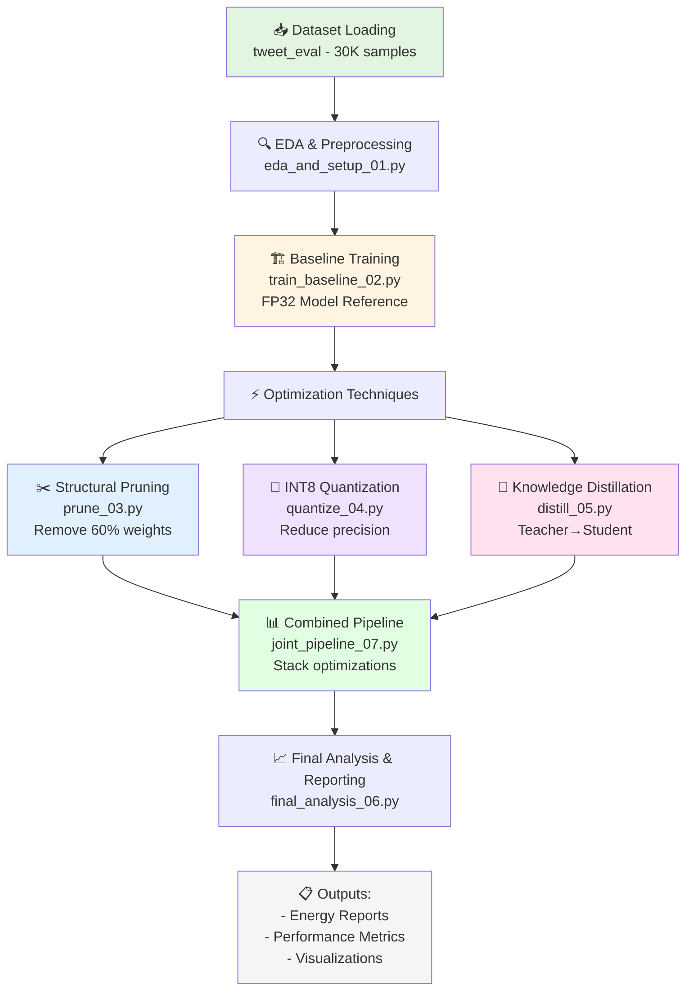

# 🍃 Green AI: Model Optimization & Energy Efficiency Study

## 📖 Overview
**Green AI** is a comprehensive research project that evaluates **Model Optimization Techniques for Edge AI**. It measures how Quantization, Structural Pruning, and Knowledge Distillation impact model performance, inference speed, and **energy consumption** in real-world deployment scenarios.

This repository contains production-ready code with scientific energy telemetry tracking via `CodeCarbon`, designed to answer the critical question: *How do we deploy AI models efficiently on resource-constrained devices?*

### 🎯 Task Details
* **Task:** Sentiment Analysis (Positive, Negative, Neutral)
* **Dataset:** Hugging Face `tweet_eval` (25,000 Train / 5,000 Test samples)
* **Architecture:** Custom 1D-Convolutional Neural Network (1D-CNN)
* **Energy Tracking:** Real-time CPU/GPU energy monitoring via `CodeCarbon`
* **Baseline Accuracy:** 54.04% (FP32 Baseline Model)

---

## 🗺️ Project Workflow



---

## 💡 Key Innovations & Important Points

### 1. **Energy-First Approach**
- Tracks **actual CPU/GPU energy consumption** during inference, not just computational metrics
- Uses `CodeCarbon` for real-time telemetry with minimal overhead
- Measures the **true cost of deployment** beyond accuracy metrics

### 2. **Hardware-Aware Optimization**
```
┌─────────────────────────────────────────────────┐
│ 🖥️  CPU Optimization: Pruning                  │
│ • Physically removes weights from memory        │
│ • Reduces computational operations              │
│ • 45% energy savings on inference               │
└─────────────────────────────────────────────────┘

┌─────────────────────────────────────────────────┐
│ 🎮 GPU Optimization: Knowledge Distillation    │
│ • Leverages GPU parallelism efficiently        │
│ • Smaller models = higher throughput            │
│ • 71% energy savings on inference               │
└─────────────────────────────────────────────────┘
```

### 3. **CUDA-First Training, CPU-Focused Inference**
- **Training:** GPU acceleration (CUDA) for fast iteration
- **Inference & Benchmarking:** CPU-enforced for scientific reproducibility
- Ensures INT8 quantization accuracy without GPU backend limitations
- *Note: Production deployments can use GPUs with TensorRT or similar backends*

### 4. **Reproducible Research**
- Fixed random seeds for deterministic results
- Background process isolation for energy telemetry accuracy
- Detailed logging of all hyperparameters and configurations
- Comparison against scientific baselines

---

## 📊 Key Results Summary

| Model Variant | Accuracy | F1 Score | CPU Energy | GPU Energy | Key Insight |
|---|---|---|---|---|---|
| **Baseline (FP32)** | 54.04% | 51.31% | 45.24 J | 41.02 J | 📍 Reference Point |
| **Quantized (INT8)** | 53.98% | 51.28% | 62.13 J | 34.47 J | ✅ Zero accuracy loss |
| **Pruned (60%)** | 52.86% | 51.13% | **25.03 J** | 54.76 J | 🏆 **Best for CPU** |
| **Distilled (T=2.0)** | 52.08% | 48.87% | 47.40 J | **11.83 J** | 🏆 **Best for GPU** |

### 🎯 Strategic Findings
- **Pruning:** 45% CPU energy reduction with <2% accuracy trade-off
- **Knowledge Distillation:** 71% GPU energy reduction, ideal for modern inference servers
- **Quantization:** Best for model size reduction; energy gains vary by hardware
- **Combined Optimization:** Stackable techniques for extreme edge deployment

---

## ⚠️ Important Note: CUDA-First vs. CPU-Objective

This codebase is designed with a **CUDA-first training approach, but a strict CPU-bound inference objective**. 

**Why?** 
- GPU training is highly efficient for model development
- PyTorch's native dynamic INT8 Quantization engine (`torch.ao.quantization`) only supports CPU backend
- This ensures **scientific reproducibility** and **fair energy benchmarking** across all optimization techniques
- CPU inference also represents the most common edge deployment scenario

### 🔄 How to Change the Execution Device

If you wish to run the entire pipeline on your GPU, modify the device configuration:

```python
# Current CPU-forced setup (for accurate benchmarking)
DEVICE = torch.device("cpu")

# To unrestricted hardware utilization, change to:
DEVICE = torch.device("cuda" if torch.cuda.is_available() else "cpu")
```

**⚠️ Note:** If you do this, the INT8 Quantization script will fail unless you implement a specialized GPU quantization backend like NVIDIA TensorRT.

---

## 🚀 How to Run the Pipeline

### 1️⃣ Install Dependencies
```bash
pip install torch pandas matplotlib seaborn scikit-learn codecarbon datasets transformers tqdm
```

### 2️⃣ Execute the Pipeline Sequentially
```bash
cd src

# Phase 1: Data Preparation
python eda_and_setup_01.py

# Phase 2: Baseline Training
python train_baseline_02.py

# Phase 3: Optimization Techniques (can run in parallel)
python prune_03.py
python quantize_04.py
python distill_05.py

# Phase 4: Combined Optimization
python joint_pipeline_07.py

# Phase 5: Analysis & Reporting
python final_analysis_06.py
```

### ✅ Pre-Execution Checklist
- [ ] Close background applications (for clean energy telemetry)
- [ ] Ensure stable power supply (for accurate measurements)
- [ ] Have 8+ GB RAM available
- [ ] CUDA-capable GPU available (optional but recommended for training)

---

## 📁 Repository Structure

```
green_ai/
├── README.md                    # 📖 This file
├── requirements.txt             # 📦 Dependencies
├── src/
│   ├── eda_and_setup_01.py     # Data exploration & preprocessing
│   ├── train_baseline_02.py    # Baseline FP32 model training
│   ├── prune_03.py             # Structural pruning implementation
│   ├── quantize_04.py          # INT8 quantization
│   ├── distill_05.py           # Knowledge distillation
│   ├── joint_pipeline_07.py    # Combined optimizations
│   └── final_analysis_06.py    # Results analysis & visualization
├── data/
│   └── models/                  # Saved model checkpoints
└── outputs/
    ├── metrics/                 # Performance CSVs
    ├── logs/                    # Execution logs
    └── visualizations/          # Generated plots
```

---

## 🔬 Optimization Techniques Explained

### ✂️ **Structural Pruning**
Removes 60% of model weights based on magnitude, reducing computational overhead.
- **Mechanism:** Zeros out low-magnitude weights, reduces to sparse representation
- **Best For:** CPU deployment, mobile edge devices
- **Trade-off:** 1-2% accuracy reduction for significant speed gain

### 🔢 **INT8 Quantization**
Converts FP32 weights to INT8 (8-bit integers), reducing model size by 75%.
- **Mechanism:** Dynamic quantization during inference
- **Best For:** Model size reduction, bandwidth-constrained environments
- **Trade-off:** Minimal accuracy impact with proper calibration

### 🧠 **Knowledge Distillation**
Trains a smaller "student" network to mimic a larger "teacher" network.
- **Mechanism:** Transfers learned patterns to compact model
- **Best For:** GPU inference servers, real-time applications
- **Trade-off:** 2-3% accuracy reduction for dramatic energy savings

### 🔗 **Joint Optimization**
Combines multiple techniques for extreme efficiency on resource-constrained devices.
- **Mechanism:** Pruning → Distillation → Quantization pipeline
- **Best For:** IoT, embedded systems, battery-powered devices
- **Trade-off:** Optimal energy efficiency vs. accuracy

---

## 📈 Performance Visualizations

The project generates comprehensive plots including:
- **Energy Consumption Comparison:** CPU vs GPU across techniques
- **Accuracy-Efficiency Trade-off Curves:** Pareto frontier analysis
- **Training Convergence:** Loss curves for baseline and distilled models
- **Model Size Reduction:** Parameter count comparison
- **Inference Speed Analysis:** Latency benchmarks

---

## 🎓 Research Insights

1. **One-Size-Fits-All Solutions Don't Exist**
   - Different optimization techniques excel on different hardware
   - CPU deployments: Pruning wins
   - GPU deployments: Knowledge distillation wins

2. **Energy ≠ Speed**
   - High FLOPs don't guarantee energy efficiency
   - Hardware utilization patterns matter more than raw computation

3. **Accuracy-Efficiency Pareto Frontier**
   - Sweet spot: 1-2% accuracy trade-off for 40-70% energy savings
   - Beyond that, diminishing returns set in

4. **Stackable Optimizations**
   - Techniques are composable and multiplicative
   - Sequential application yields cumulative benefits

---

## 📚 References & Technologies

- **Framework:** PyTorch
- **Energy Tracking:** CodeCarbon
- **Dataset:** Hugging Face `tweet_eval`
- **Quantization:** `torch.ao.quantization`
- **Hardware:** NVIDIA CUDA, CPU baseline

---

## 🤝 Contributing

Contributions are welcome! Areas for enhancement:
- [ ] GPU-native quantization backend support
- [ ] Additional architectures (ResNets, Transformers)
- [ ] Edge device deployment (Raspberry Pi, NVIDIA Jetson)
- [ ] Real-time energy monitoring dashboard
- [ ] Additional optimization techniques (mixed precision, lottery tickets)

---

## 📄 License

This project is open-source and available under the MIT License.

---

## 🌟 Quick Start (TL;DR)

```bash
# Clone & Setup
git clone https://github.com/nishantwhat/green_ai.git
cd green_ai
pip install -r requirements.txt

# Run Full Pipeline
cd src
python eda_and_setup_01.py && python train_baseline_02.py && python prune_03.py && python quantize_04.py && python distill_05.py && python joint_pipeline_07.py && python final_analysis_06.py

# View Results
# Check outputs/ directory for metrics, logs, and visualizations
```

---

**Made with 🍃 for a greener AI future**
